# Diagrama de Casos de Uso - Sistema de Gestão de Frotas

## Versão Atualizada

Este documento apresenta o diagrama de casos de uso atualizado do Sistema de Gestão de Frotas, refletindo todas as funcionalidades implementadas no sistema.

---

## Diagrama de Casos de Uso (Mermaid)

```mermaid
graph TB
    %% ============================================
    %% ATORES
    %% ============================================
    Admin[👤 Administrador]
    Gestor[👤 Gestor de Frota]
    Condutor[👤 Condutor]

    %% ============================================
    %% CASOS DE USO
    %% ============================================
    subgraph Sistema["Sistema de Gestão de Frotas"]
        subgraph Auth["🔐 Autenticação e Perfil"]
            UC01[Login]
            UC02[Logout]
            UC03[Recuperar Senha]
            UC04[Trocar Senha]
        end

        subgraph Checklists["📋 Gestão de Checklists"]
            UC05[Preencher Checklist Diário]
            UC06[Enviar Fotos de Avarias]
            UC07[Visualizar Checklists Enviados]
            UC08[Gerenciar Checklists]
        end

        subgraph Users["👥 Gestão de Usuários"]
            UC09[Gerenciar Usuários e Permissões]
            UC10[Gerenciar Condutores]
        end

        subgraph Vehicles["🚗 Gestão de Veículos"]
            UC11[Gerenciar Veículos]
            UC12[Visualizar Histórico de Veículos]
        end

        subgraph Maintenance["🔧 Gestão de Manutenções"]
            UC13[Gerenciar Manutenções]
        end

        subgraph Monitor["📊 Monitoramento e Auditoria"]
            UC14[Visualizar Dashboard]
            UC15[Visualizar Logs de Auditoria]
        end
    end

    %% Relacionamentos entre casos de uso
    UC04 -.->|<<extend>>| UC01
    UC06 -.->|<<extend>>| UC05

    %% ============================================
    %% ADMINISTRADOR - Acesso Total (14 casos de uso)
    %% ============================================
    Admin --> UC01
    Admin --> UC02
    Admin --> UC03
    Admin --> UC04
    Admin --> UC07
    Admin --> UC08
    Admin --> UC09
    Admin --> UC10
    Admin --> UC11
    Admin --> UC12
    Admin --> UC13
    Admin --> UC14
    Admin --> UC15

    %% ============================================
    %% GESTOR DE FROTA - Gestão Operacional (12 casos de uso)
    %% ============================================
    Gestor --> UC01
    Gestor --> UC02
    Gestor --> UC03
    Gestor --> UC04
    Gestor --> UC07
    Gestor --> UC08
    Gestor --> UC10
    Gestor --> UC11
    Gestor --> UC12
    Gestor --> UC13
    Gestor --> UC14

    %% ============================================
    %% CONDUTOR - Operações de Checklist (6 casos de uso)
    %% ============================================
    Condutor --> UC01
    Condutor --> UC02
    Condutor --> UC03
    Condutor --> UC04
    Condutor --> UC05
    Condutor --> UC07

    %% Estilos
    classDef actorStyle fill:#FFFFFF,stroke:#000000,stroke-width:3px,font-weight:bold,font-size:12px
    classDef useCaseStyle fill:#E1F5FE,stroke:#01579B,stroke-width:2px,font-size:10px

    class Admin,Gestor,Condutor actorStyle
    class UC01,UC02,UC03,UC04,UC05,UC06,UC07,UC08,UC09,UC10,UC11,UC12,UC13,UC14,UC15 useCaseStyle
```

---

## Resumo dos Casos de Uso por Ator

### 👤 Administrador (14 casos de uso)
- **Autenticação:** Login, Logout, Recuperar Senha, Trocar Senha
- **Checklists:** Visualizar Checklists Enviados, Gerenciar Checklists
- **Usuários:** Gerenciar Usuários e Permissões, Gerenciar Condutores
- **Veículos:** Gerenciar Veículos, Visualizar Histórico de Veículos
- **Manutenções:** Gerenciar Manutenções
- **Monitoramento:** Visualizar Dashboard, Visualizar Logs de Auditoria

### 👤 Gestor de Frota (12 casos de uso)
- **Autenticação:** Login, Logout, Recuperar Senha, Trocar Senha
- **Checklists:** Visualizar Checklists Enviados, Gerenciar Checklists
- **Usuários:** Gerenciar Condutores (sem excluir)
- **Veículos:** Gerenciar Veículos (sem excluir), Visualizar Histórico de Veículos
- **Manutenções:** Gerenciar Manutenções (sem excluir)
- **Monitoramento:** Visualizar Dashboard

### 👤 Condutor (6 casos de uso)
- **Autenticação:** Login, Logout, Recuperar Senha, Trocar Senha
- **Checklists:** Preencher Checklist Diário, Visualizar Checklists Enviados
- **Extensão:** Enviar Fotos de Avarias (opcional durante o preenchimento)

---

## Relacionamentos Especiais

### Relacionamento <<extend>>
- **Trocar Senha** <<extend>> **Login**: Obrigatório no primeiro login
- **Enviar Fotos de Avarias** <<extend>> **Preencher Checklist Diário**: Opcional durante o preenchimento

---

## Diferenças de Permissões

### Gerenciar Veículos
- **Administrador:** Pode criar, editar e **excluir** veículos
- **Gestor:** Pode criar, editar e visualizar, mas **não pode excluir**

### Gerenciar Manutenções
- **Administrador:** Pode criar, editar, alterar status e **excluir** manutenções
- **Gestor:** Pode criar, editar e alterar status, mas **não pode excluir**

### Gerenciar Usuários
- **Administrador:** Pode criar, editar e **excluir** usuários de qualquer perfil
- **Gestor:** Pode criar e editar apenas condutores, mas **não pode excluir**

### Logs de Auditoria
- **Administrador:** Acesso exclusivo
- **Gestor:** Sem acesso

---

## Notas Importantes

1. **Checklists por Veículo:** O condutor pode enviar múltiplos checklists por dia, desde que seja um checklist diferente para cada veículo (regra: 1 checklist por veículo por dia).

2. **Primeiro Login:** Todos os usuários devem trocar a senha no primeiro login (senha padrão: "123456").

3. **Dashboard:** Exibe KPIs em tempo real, incluindo:
   - Checklists Hoje (condutores ativos vs. condutores que enviaram)
   - Manutenções por status (Agendada, Em Andamento, Concluída)
   - Alertas de CNH vencida ou próxima do vencimento
   - Tendências dos últimos 7 dias

4. **Histórico de Veículos:** Permite visualizar todos os checklists e manutenções relacionados a um veículo específico.

---

## Versão do Diagrama

- **Data de Atualização:** Janeiro 2025
- **Versão do Sistema:** 1.0.0
- **Total de Casos de Uso:** 15

